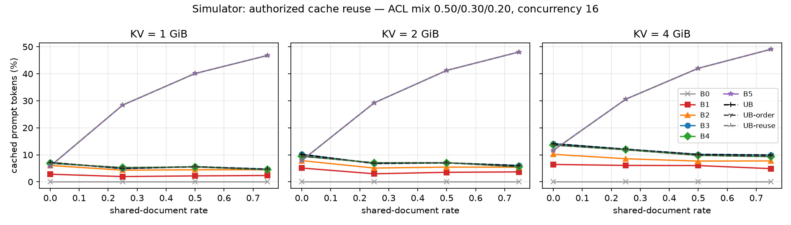
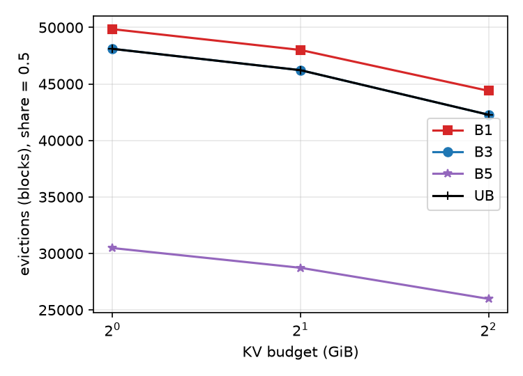
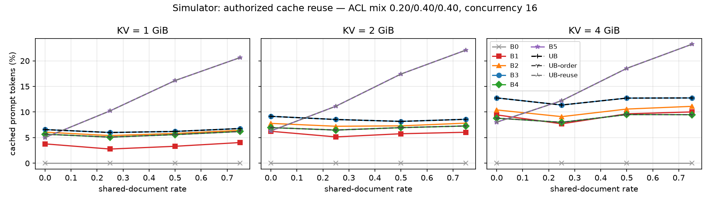

# Access-Aware KV-Cache Sharing for Resource-Constrained RAG Serving

CSE 598 (Data-Intensive Systems for ML) project — Vedang Vasant Avaghade, Sri Harshith Goli.

Multi-user RAG serving reprocesses the same long document prefixes for many users. vLLM's
prefix cache can reuse that work, but its only isolation primitive is one request-level
`cache_salt`: **global sharing** is fast but leaks cache state across users through timing,
**per-user salting** is safe but forbids two authorized users from sharing an identical
public/group prefix. This repo implements the proposal's alternative: derive **cache scopes
from document ACLs**, switch scope *inside* a request wherever the effective ACL of the
prefix narrows, and use the same ACL structure to **order evidence** so that shareable
prefixes stay shareable for longer — all under a deliberately small KV-cache budget.

Everything is inference-only: no training, no kernels, one small vLLM plugin.

---

## 1. What is implemented (proposal → code)

| Proposal component | Where | Notes |
|---|---|---|
| ACL model, effective prefix ACL `ACL(P_k)=∩ ACL(D_i)` (C1) | [`aclkv/acl.py`](aclkv/acl.py) | atoms `public`, `group:g`, `user:u`; intersection, audiences, cache-hit gate |
| Server-derived, fixed-size, keyed scope ids (GHSA-wpww-v874-ph2p) | [`aclkv/scope.py`](aclkv/scope.py) | `HMAC-SHA256(key, canonical_acl)[:16]`, ≤32 barriers, wire format `aclkv1:<sid>@<off>,...` |
| **Idea A – ACL-derived multi-scope caching** (modified serving path) | [`aclkv/vllm_plugin.py`](aclkv/vllm_plugin.py) | vLLM *general plugin*; patches `generate_block_hash_extra_keys` so one request can carry several scope barriers; parent-hash chaining makes later blocks inherit the restriction |
| **Idea B – access-aware ordering** | [`aclkv/ordering.py`](aclkv/ordering.py) `order_acl_aware` | broad→narrow, retrieval rank within class, `max_shift` bounds displacement (quality guard) |
| **Idea C – reuse-aware ordering (stretch)** | `order_reuse_aware` | hot chunks (online decayed popularity) first in a *canonical* order, cold chunks by relevance |
| Context builder (block-aligned segments, token-id prompts) | [`aclkv/context.py`](aclkv/context.py) | pads each doc to a 16-token block so a doc's blocks never depend on the next doc |
| Baselines B0–B4, stretch B5, insecure upper bounds | [`aclkv/policies.py`](aclkv/policies.py) | see table below |
| Synthetic ACL workload over HotpotQA | [`aclkv/workload.py`](aclkv/workload.py), [`aclkv/data_prep.py`](aclkv/data_prep.py) | users/groups, ACL mix, shared-document rate, question pool, seeds |
| Trace-driven cache simulator + security audit (risk fallback) | [`aclkv/simulator.py`](aclkv/simulator.py) | mirrors vLLM v0.29 block pool: full-block hashing, `num_tokens-1` hit cap, LRU free queue, reverse-order free, touch, evictions; adversarial *probe* mode |
| Live benchmark, TTFT/throughput/cached tokens, QA EM/F1 | [`aclkv/bench.py`](aclkv/bench.py), [`aclkv/client.py`](aclkv/client.py), [`aclkv/qa_eval.py`](aclkv/qa_eval.py) | closed-loop concurrency, Prometheus deltas, LLM-judge option |
| Timing-probe experiment | [`scripts/security_probe.py`](scripts/security_probe.py) | attacker replays a victim's tokens with no / forged / stolen salt |

### Policies

| name | caching mode | ordering | secure | description |
|---|---|---|---|---|
| **B0** | `none` | retrieval | ✓ | no prefix caching (unique nonce salt per request; `TRUE_B0=1` also runs a server with caching disabled) |
| **B1** | `per_user` | retrieval | ✓ | vLLM's documented mitigation: one salt per user |
| **B2** | `two_level` | retrieval | ✓ | one shared(public)/private(user) boundary at the first non-public doc |
| **B3** | `acl_scope` | retrieval | ✓ | ACL-derived multi-scope caching (Idea A) |
| **B4** | `acl_scope` | acl_aware | ✓ | B3 + access-aware ordering (Idea B) |
| **B5** | `acl_scope` | reuse_aware | ✓ | B3 + reuse-aware ordering (Idea C, stretch) |
| UB / UB-order / UB-reuse | `global` | retrieval / acl_aware / reuse_aware | ✗ | unrestricted sharing — efficiency upper bounds only |

### How a request flows

```
user + groups, query, retrieved chunks + ACLs
   │ 1. authorization filter            (acl.authorization_filter)
   │ 2. prefix ACL propagation          (acl.effective_prefix_acls)
   │ 3. context builder / ordering      (ordering.*, context.ContextBuilder)
   │ 4. scope plan → barriers → salt    (policies.plan_scopes, scope.encode_cache_salt)
   ▼
POST /v1/completions {prompt: [token ids], cache_salt: "aclkv1:9c1e…@0,5b7a…@352,…"}
   ▼
vLLM EngineCore → aclkv plugin keys block(352//16) with scope 5b7a…; every later
block chains from it → users with the same authorized prefix hash to the same blocks,
everyone else lands in a disjoint namespace.
```

The salt travels through vLLM's existing plumbing unchanged; the *only* engine change is how
block-hash extra keys are generated (`vllm/v1/core/kv_cache_utils.py`, v0.29.0). Malformed
salts fail closed (treated as an opaque request-level salt). A `--scope-mode marker` fallback
implements the same barriers as in-prompt sentinel tokens and works on a stock vLLM.

---

## 2. Quick start without a GPU (simulator, ~2 min)

```bash
git clone https://github.com/SriGoli-0123/disml-kv.git && cd disml-kv
git checkout feat/acl-scoped-kv-cache
python3 -m venv .venv && source .venv/bin/activate
pip install -e ".[dev]"
python -m pytest -q                                   # 42 tests incl. the go/no-go checkpoint

python scripts/prepare_data.py --max-questions 3000 --tokenizer Qwen/Qwen2.5-7B-Instruct
python scripts/gen_workloads.py                       # 12 workloads: 4 share rates x 3 ACL mixes
python scripts/run_sim_matrix.py --tag matrix         # policies x {1,2,4} GiB x {4,16} concurrency
python scripts/summarize.py                           # -> results/summary.md
python scripts/plot_results.py                        # -> results/plots/*.png
```

The simulator gives the deterministic metrics (cached/recomputed tokens, evictions, unique
blocks, unauthorized hits, probe leaks). TTFT and throughput need the live server below.

---

## 3. A100 runbook

### 3.1 One-time setup

```bash
git clone https://github.com/SriGoli-0123/disml-kv.git && cd disml-kv
git checkout feat/acl-scoped-kv-cache
bash scripts/setup_a100.sh          # venv + vllm==0.29.0 + this package + data + workloads
source .venv/bin/activate
export ACLKV_SCOPE_KEY=$(python -c "import secrets; print(secrets.token_hex(32))")   # optional; dev key otherwise
```

On ASU SOL do this on a login node inside `/scratch/$USER`, with `module load mamba/latest cuda-12.1.1-gcc-12.1.0`
first and `VENV=/scratch/$USER/aclkv-venv HF_HOME=/scratch/$USER/hf_cache`.

### 3.2 Start the server (shell 1) and verify the plugin (shell 2)

```bash
bash scripts/start_vllm.sh 2            # Qwen2.5-7B-Instruct, KV cache capped at 2 GiB, port 8000
```

```bash
python scripts/smoke_test_plugin.py     # must print "PLUGIN OK"
```

The smoke test sends one 160-token prompt under different salts and checks `cached_tokens`:
`[public@0]` twice → 0 then 144; `[public@0, group@80]` → **80** (only the shared public
blocks hit — without the plugin this is 0); no salt / forged scope id → 0; stock salt `"abc"`
still behaves like vanilla vLLM. Look for `aclkv: scoped prefix-cache hashing installed` in
the server log.

### 3.3 Run the experiments

```bash
# ~25 min: 2 GiB, share {0, 0.5}, C=16, policies B0 B1 B3 B4 B5 UB, + security probe
QUICK=1 bash scripts/run_bench_matrix.sh
```

```bash
# full matrix (~6-8 h): {1,2,4} GiB x share {0,.25,.5,.75} x C {4,16} x 7 policies
bash scripts/run_bench_matrix.sh
```

```bash
# other ACL mixes / a hand-picked subset / true no-caching server for B0
MIX=restrictive KV_GIBS="2" SHARES="0.5" CONCS="16" POLICIES="B1 B3 B5" bash scripts/run_bench_matrix.sh
TRUE_B0=1 KV_GIBS="2" SHARES="0.5" CONCS="16" POLICIES="B0" bash scripts/run_bench_matrix.sh
```

```bash
# on SOL as a batch job
sbatch scripts/sol_a100.sbatch
sbatch --export=ALL,QUICK=1 -t 1:30:00 scripts/sol_a100.sbatch
```

A single run against an already-running server:

```bash
python -m aclkv.bench --workload data/workloads/w_share0.50_mix-default_u20_s0.json \
  --policies B1 B3 B4 B5 --concurrency 16 --kv-gib 2 --out-dir results/bench
```

Security / timing probe alone (needs a running server):

```bash
python scripts/security_probe.py --workload data/workloads/w_share0.50_mix-default_u20_s0.json --n 20
```

Ordering-quality ablation (RQ2): bound displacement and compare EM/F1 across orderings.

```bash
for s in 0 2 4; do
  python -m aclkv.bench --workload data/workloads/w_share0.50_mix-default_u20_s0.json \
    --policies B3 B4 B5 --max-shift $s --tag shift$s --concurrency 16 --kv-gib 2
done
```

Then `python scripts/summarize.py && python scripts/plot_results.py` — tables in
`results/summary.md`, figures in `results/plots/`.

Useful knobs: `MODEL=Qwen/Qwen3-8B CHAT_FORMAT=qwen3` (Qwen3 non-thinking template),
`--scope-mode marker` (no plugin needed), `--no-align` (ablate block alignment),
`--min-pop` (reuse-aware hot threshold), `scripts/gen_workloads.py --n-users 100 --share-rates 0.5`.

---

## 4. What to expect

### 4.1 Baselines and improvements (simulator, real HotpotQA prompts, 20 users / 5 groups / 400 requests)

Pre-computed simulator outputs are checked in under [`docs/`](docs/): figures in
[`docs/plots/`](docs/plots/), the full sweep in [`docs/sim/sim_matrix_summary.csv`](docs/sim/sim_matrix_summary.csv)
and its tables in [`docs/sim/sim_summary.md`](docs/sim/sim_summary.md).




Cached prompt tokens (%) — ACL mix 0.5/0.3/0.2 (chunk level), KV = 2 GiB, concurrency 16,
Qwen2.5-7B-Instruct tokenization (mean prompt 1.5k–2.1k tokens). Full tables: run step 2.

| policy | share 0.00 | share 0.25 | share 0.50 | share 0.75 | adversarial-probe leaks |
|---|---|---|---|---|---|
| B0 no caching | 0.0 | 0.0 | 0.0 | 0.0 | 0 |
| B1 per-user salt | 5.1 | 3.0 | 3.5 | 3.7 | 0 |
| B2 one boundary | 7.8 | 5.1 | 5.5 | 5.4 | 0 |
| **B3 ACL scopes** | 10.2 | 6.8 | 7.0 | 6.0 | **0** |
| **B4 + ACL-aware order** | 9.4 | 7.1 | 7.1 | 5.5 | **0** |
| **B5 + reuse-aware order** | 7.9 | **29.2** | **41.2** | **48.1** | **0** |
| UB global (insecure) | 10.2 | 6.8 | 7.0 | 6.0 | 28 692 |

Reading the table:

* **Security (RQ1, hard constraint).** Every scoped policy shows zero unauthorized hits in the
  honest replay *and* zero leaks when an unauthorized user replays a victim's exact token
  sequence at the engine without the keyed scope ids; global sharing leaks tens of thousands
  of blocks per run. The live `security_probe.py` reproduces this with `cached_tokens` and TTFT
  on the real server (attacker TTFT ≈ cold TTFT under B3–B5, ≈ warm TTFT under UB).
* **Scoping is free (RQ1).** B3's cached tokens equal the insecure upper bound *exactly*
  (B4 = UB-order, B5 = UB-reuse): two honest users with the same authorized prefix get the
  same scope ids, so ACL scopes never split a namespace that global sharing would have
  shared. Per-user salting (B1) keeps only a user's own preamble (~3–5%). B3 roughly doubles
  B1's reuse in every setting.
* **Ordering is where the big win is (RQ2/RQ3).** With relevance order, popular documents sit
  at different positions in every prompt, so even global sharing only reaches 6–10%. Broad→
  narrow ordering alone (B4) barely helps because the *within-class* order still follows the
  per-request relevance rank. The reuse-aware order (B5) places hot chunks in a canonical
  order and reaches **29–48% cached tokens** at 25–75% shared-document rate — 8–13× the safe
  per-user baseline — and cuts evictions from ~48k to ~25k blocks at share 0.75 / 2 GiB.
* **Why B5 rises steeply while the others stay flat.** Prefix caching only reuses an *exact*
  prefix. Under retrieval order the first document after the preamble is question-specific
  (168 distinct first docs in 400 requests) and the hot documents added by `share_rate` are
  ranked at positions 6–9 by BM25, behind question-specific docs, so they never contribute
  to a prefix match. B5 moves hot chunks to the front in a canonical order (16 distinct first
  docs; 384/400 requests start with a doc seen before). Second, B3's latent sharing comes from
  exact question repeats (237/400 requests) that are a median of 80 requests apart, while a
  2 GiB cache holds ~21 requests of KV, so those blocks are evicted before they are reused
  (B3 reaches 30% only with an unlimited cache; B5 is budget-insensitive: 41 → 42 → 43.5%
  at 2 / 4 / ∞ GiB). Under memory pressure, *where in the prompt* and *how recently* shared
  content appears matters more than how much is shared.
* **Break-even (RQ3).** At share rate 0 there is nothing hot; B5 falls slightly *below* B3
  (7.9 vs 10.2%) because a repeated question is promoted to canonical order only on its second
  appearance. Below ~10–15% shared documents plain B3 is the better choice; the simulator
  sweep locates the crossover for any workload/mix. With the restrictive mix (0.2/0.4/0.4)
  B5 still reaches 11–22% while B3 stays ≈ 8–9%.


* **Cache pressure.** At 1 GiB (≈18.7k tokens for this model) sixteen 1.6–2k-token requests do
  not fit, so effective concurrency drops (`stalls` in the CSV, `preemptions`/waiting requests
  on the live server); reuse still helps because fewer blocks are recomputed, but absolute
  hit rates are lower. 4 GiB shows the largest hit rates.

### 4.2 Live server (what the bench adds)

* **TTFT** tracks recomputed prompt tokens: with ~1.7k-token prompts on an A100, expect cold
  TTFT of a few hundred ms at C=16; B5 at share ≥ 0.5 should cut p50 TTFT by roughly the cached
  fraction (30–45%) and p95 more under pressure, B3/B4 by 5–10% over B1, B0 the highest.
* **Throughput (req/s, prompt tok/s)** rises in proportion to the prefill saved; decode
  (48 max tokens) is unchanged, so gains are largest at high concurrency.
* **`cached_tokens`** from the usage payload should match the simulator's `cached_pct` within
  a few percent (concurrent arrivals and vLLM's chunked prefill cause small differences).
* **QA quality** (EM/F1 on HotpotQA, `contains`, optional LLM judge): B0–B3 are identical
  prompts in different namespaces and must give identical answers at temperature 0. B4/B5
  reorder evidence; the expected effect is within ~1–2 F1 points, and `--max-shift 2` bounds
  any drop at a small cost in reuse — report both.
* **Preemptions / waiting** at 1 GiB are the price of the budget; compare across policies at
  the same budget.

### 4.3 Metrics glossary

| metric | source | meaning |
|---|---|---|
| `cached_pct`, `recomputed_tokens` | bench (usage) and simulator | prefix-cache hits in prompt tokens |
| `ttft` p50/p95, `e2e`, `req_per_s`, `prompt_tok_per_s` | bench | client-side streaming timing, closed loop |
| `evictions`, `stalls`, `max_table_size`, `unique_hashes_seen` | simulator | block-pool behaviour under the byte budget |
| `unauthorized_hits` | simulator, honest replay | hits on blocks whose effective ACL excludes the requester (must be 0) |
| `probe_unauthorized_hits` | simulator, adversarial replay | leaks to an attacker without scope ids (0 for B1–B5, >0 for UB) |
| `attacker_hits`, attacker TTFT | `security_probe.py` | the same on the real engine |
| `em`, `f1`, `contains` | bench | HotpotQA answer quality |
| `prom_delta` | bench | `vllm:prefix_cache_hits/queries`, `vllm:num_preemptions`, `vllm:prompt_tokens_cached` |

---

## 5. Design notes and limitations

* **Threat model.** The middleware is the trusted layer (as in vLLM's `cache_salt` design):
  it filters documents, derives scope ids with a secret key and never issues a scope id the
  requester is not authorized for. Scoped hashing is defence in depth at the engine: an
  attacker who reaches the engine and even *knows a restricted document's text* cannot obtain a
  hit without the keyed scope id. With an honest middleware, a workload replay cannot leak under
  any policy (content the requester holds is content they may read) — which is why the audit
  includes the adversarial probe.
* **Mid-block barriers** are safe (the block that contains a barrier is keyed with the narrower
  scope); block alignment only avoids losing partial blocks.
* **ACL algebra** supports conjunctions (`group:a&group:b`); disjunctive document ACLs are out
  of scope.
* The simulator models concurrency as a sliding window of in-flight requests and one-shot
  prefill; it reproduces vLLM's hashing, LRU and eviction order but not scheduling timing.
* Evidence-level ACL mix is more public than the chunk-level mix because the authorization
  filter removes restricted chunks the requester cannot read; both are recorded in the
  workload file (`stats.evidence_acl_mix`).

## 6. Repository layout

```
aclkv/            package (see table in §1)
scripts/          prepare_data, gen_workloads, run_sim_matrix, start_vllm, smoke_test_plugin,
                  run_bench_matrix, security_probe, summarize, plot_results, sol_a100.sbatch
configs/matrix.json   experiment matrix (model, budgets, share rates, concurrency, ACL mixes)
tests/            42 unit tests (ACL algebra, scope encoding, ordering, context, plugin, simulator, client)
data/             raw/, prepared/ (corpus.jsonl, questions.jsonl), workloads/   (generated, git-ignored)
results/          sim/, bench/, security_probe*.json, summary.md, plots/         (git-ignored)
docs/             checked-in simulator outputs: plots/ (PNG), sim/ (CSV + Markdown tables)
```
